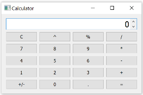

# BiasCalculator-Pro
This is a calculator designed as part of OSSE assignment by BITS-WILP students. The programming language chosen for the development in `Python3.x`.

## Installation
Download and install latest version of `Python3` from official website <https://www.python.org/downloads/>

Install the below libraries using pip,
```bash
pip install pyqt5
```

## Caculator UI


For UI development, a python library called `PyQT5` has been used. This is a widget based UI development library based on cross-platform GUI toolkit QT.

## Features
This calculator supports all basic mathematic operations. The calcultor is also scalable to add more scientific operations in the upcoming releases.
The features which are currently supported are listed below,
- Addition
- Subtration
- Division
- Multiplication
- Percentile
- Power

## Team Members

|Name|BITS ID|Email|

|----|-----|-----|
|Nirmal Kumar S|2020MT93549|<2020mt93549@wilp.bits-pilani.ac.in>
|Nitin Philip|2020MT93552|<2020mt93552@wilp.bits-pilani.ac.in>
|Prabhu S|2020MT93726|<2020mt93726@wilp.bits-pilani.ac.in>
|Raja Simhan. N|2020MT93257|<2020mt93257@wilp.bits-pilani.ac.in>
|Vivek G|2020MT93582|<2020mt93582@wilp.bits-pilani.ac.in>

## Workflow
### Gitflow Workflow/Branching Model used in this repository:
The Gitflow Workflow uses all the same constructs discussed in the Feature Branch Workflow and also defines a strict branching model around project releases. Gitflow is ideally suited for projects that have a scheduled release cycle and for the DevOps best practice of continuous delivery. In addition to feature branches, it uses individual branches for preparing, maintaining, and recording releases.

Instead of a single main branch, this workflow uses two branches to record the history of the project. The main branch stores the official release history, and the develop branch serves as an integration branch for features. It's also convenient to tag all commits in the main branch with a version number.


#### Method-1
Instead of branching off of the main, feature branches use the develop branch as their parent. Completed features are merged back into develop and never interact with main.


#### Method-2
Once the develop branch has acquired enough features, a release branch is created with develop as the parent. Creating this branch starts the next release cycle, so no new features can be added after this point. Only bug fixes, documentation, or other release-oriented assets should be added. Once it is ready to ship, the release branch gets merged into main and tagged with a version number.

Using a dedicated branch to prepare releases makes it possible for one team to polish the current release while another team continues working on features for the next release. It also creates well-defined phases of development that are seen in the structure of the repository.

### forked repository workflow
In a forked repository workflow, you create a fork of the central repository, which becomes your personal copy of the repository on the same hosting platform. After creating a fork of the repository, you clone the fork. Then, use the feature branch workflow to implement code changes and push a new feature branch to your fork of the official repository.
Next, open a pull request for the new feature branch in your fork. After a representative of the official repository approves the pull request, the feature branch from your fork is merged into the original repository.

#### NOTE
Often software projects adopt branch naming conventions or standards. Branch naming standards help you summarize the code changes contained in a branch.
The following are examples of branch name templates for a branch naming standard:
feature/feature-id/description
hotfix/issue-number/description
release/release-string
A branch naming standard also defines the set of allowable characters. Branch names are often limited to alphanumeric characters and field seperators (such as /, _, or - characters).

## License

[MIT](http://www.opensource.org/licenses/mit-license.php)
